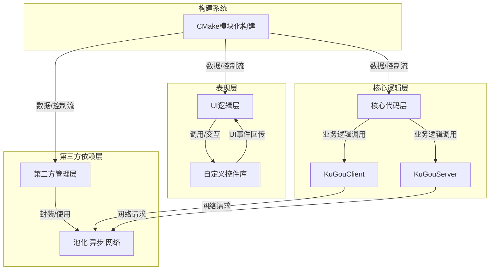

### 📚项目介绍

Based on Qt Widget + UiTools module + Custom control + QSS + QsLog + Custom **Spdlog** + **JWT** + **FFmpeg** + **SDL**

使用**CMake**进行模块化管理，确保核心组件（如用户界面、媒体播放器和网络层）的**高度解耦**，参照酷狗客户端，高仿并且优化界面，

应用程序现采用 **FFmpeg** 和 **SDL** 进行音频解码与播放来实现音频播放，从而提供更灵活、更强大的音乐播放体验。

集成 **QsLog** 和自定义 **Spdlog** 实现健壮的日志系统，使用 JWT 确保安全的用户认证。采用**SQLite**存储音乐元数据（标题/专辑/路径），使用Qt
SQL模块实现播放记录管理

通过 **QNetworkAccessManager** 实现在线音乐流媒体播放，结合 QtConcurrent 和 QFutureWatcher 实现非阻塞线程串行任务调度，基于
**QThreadPool** 构建动态弹性线程池，通过 QRunnable 封装任务单元，实现线程资源的自动回收。

项目难点：播放列表、菜单功能，**歌曲搜索**、**歌词显示**、播放控制等**播放器核心功能**设计问题，自定义控件和事件响应，遮罩绘图，控件拉伸，
**特效绘制**， 堆栈界面**懒加载**、**LRU缓存**，**JWT验证登录**、**池化**技术、**Ai对话**、**异步非阻塞式线程**、**日志系统**、**网络模块**封装、**开源库**（如 FFmpeg 和 SDL）的集成与优化，以提升媒体播放能力。

## 🎨 界面技术栈

视觉魔法师：QSS样式引擎 + SVG矢量图标 + 动态渐变蒙版

交互黑科技：属性动画系统 + 智能布局适配

性能保障：双缓冲绘图 + 异步加载 + 局部刷新策略

✅ 支持无损格式直通

✅ 32段可视化均衡器

✅ 动态响度补偿技术

### 🔌 核心架构

<!-- ] -->

## 🛠️ 技术全景图

### 0.登录注册界面

### 1.为你推荐界面

### 2.乐库界面

### 3.频道界面

### 4.视频界面

### 5.Ai对话界面(略卡😅)

### 6.歌单界面

### 7.每日推荐界面

### 8.我的收藏界面

### 9.本地与下载界面

### 10.音乐云盘界面

### 11.已购音乐界面

### 12.最近播放界面

### 13.全部音乐界面

### 14.探索界面

### 15.听书界面

### 16.直播界面

### 17.网络歌曲搜索界面

---

